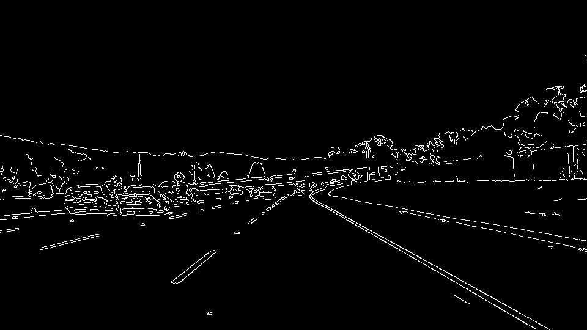
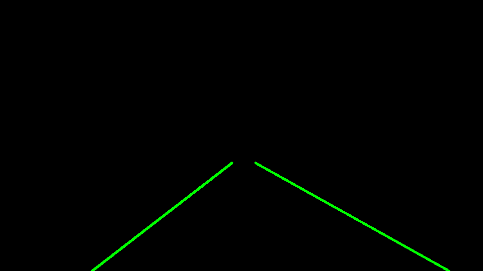

# **Finding Lane Lines on the Road** 

## Writeup Template

### You can use this file as a template for your writeup if you want to submit it as a markdown file. But feel free to use some other method and submit a pdf if you prefer.

---

**Finding Lane Lines on the Road**

The goals / steps of this project are the following:
* Make a pipeline that finds lane lines on the road
* Reflect on your work in a written report

[//]: # (Image References)

[image1]: ./examples/grayscale.jpg "Grayscale"

---

### Reflection

### 1. Describe your pipeline. As part of the description, explain how you modified the draw_lines() function.

My pipeline consisted of 5 steps. First, I converted the images to grayscale, 

Then I blurred the heck out of them with Gaussian blur. I found a setting of 25 gets the most noise out while leaving in the lines you need. 

Next, I used the Canny transform to determine where the edge points of the lines were. Canny uses a form of differential calculation to determine which points are edges. Settings of low=20 and high=40 were about all I could do and still get the proper lines out of the next step. 

Then I masked off the area I was interested in, where I would find the lines. 

The Next step was to use the Hough transform algorithm to make lines out of the points. Hough transforms point x and y coordinates to rho and theta. Lines of points will have similar theta and rho values. I set the threshold for theta at 20, which gave me a good set of edge lines. 

Lastly, I painted my caluclated lines onto the final image. 

In order to draw a single line on the left and right lanes, I modified the draw_lines() function by ...
... ignoring slope to start with. I got lines with infinite slope on occasion, and that caused thrown exceptions. Also, I don't believe that slope will be completely useful around curves. 
Instead, I sorted the line points into left and right, based on the center of perspective. I then used a best fit function to get slope and Y-intercept for my generalization lines. Did some algebra, plotted the best fit lines onto the images. 

If you'd like to include images to show how the pipeline works, here is how to include an image: 

![alt text][image1]

### 2. Identify potential shortcomings with your current pipeline

One potential shortcoming would be what would happen when ... 
... we get confusing lines on the road? The challenge video has lots of them: road material changes, the hood caught on the dash cam, etc. These extraneious lines caused my algorithms to fall apart and map incorrectly. I need to find a way to ignore those. 

Another shortcoming could be ...
... we ignore the most important element of the lines: the thickness. We use an algorithm (Canny and Hough) that finds the edges of the lines. But that also finds the edges of lots of other things. And it ignores the most important fact of identifying the line: the thickness. We know that the right and left lines are the lane markers because they are comprised of thick rectangles. But we ignore the shape and color, focusing on edge detection. 

### 3. Suggest possible improvements to your pipeline

A possible improvement would be to ...
... mask out the internal section where all the noise seems to come from. 

Another potential improvement could be to ...
...identify lines by color and thickness and length. 

